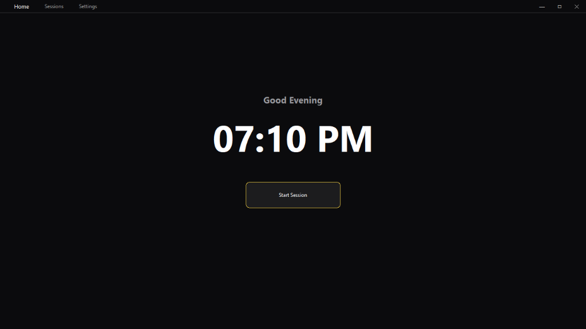
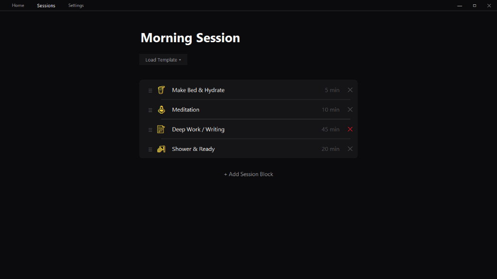
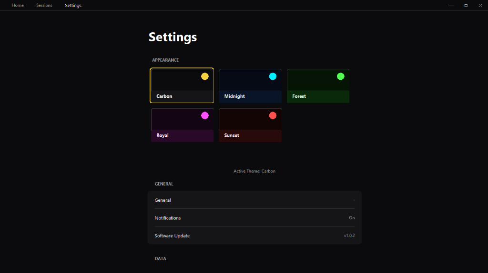

<div align="center">

# InFlow
### Your Flow State, Engineered.


<br />



<br />
<br />

**InFlow** is a desktop-first productivity environment inspired by *The Sessions*. It is designed to minimize friction and maximize deep work through a structured, session-based workflow.

[Features](#-features) • [Installation](#-installation) • [Contributing](#-contributing)

</div>

---

## 🌊 Philosophy

In a world of constant distraction, **InFlow** provides a sanctuary for focus. Unlike traditional calendar apps that visualize time as a scarce resource to be managed, InFlow visualizes time as a **stream of focus**.

> "The secret of getting ahead is getting started." - *Mark Twain*

InFlow helps you:
1.  **Define Intent**: Break your day into distinct "Sessions" rather than rigid calendar slots.
2.  **Enter the Zone**: A dedicated, full-screen focus mode eliminates desktop clutter.
3.  **Maintain Rhythm**: Seamless transitions between resting and working states.

---

## ✨ Features

### 🎯 Session-Based Workflow
Build your daily routine using modular "Blocks". Whether it's *Deep Work*, *Meditation*, or a *Quick Break*, your day is your own.

<div align="center">
  
</div>

*   **Drag & Drop Ordering**: Fluidly rearrange your day as priorities shift.
*   **Template Library**: Save your perfect morning routine and reuse it instantly. (Coming Soon)

### 🎨 Adaptive Aesthetics
Your environment shapes your mindset. InFlow features a state-of-the-art design engine with selectable themes to match your cognitive state.

<div align="center">
  
</div>

*   **OLED-Ready Dark Modes**: Deep blacks and vibrant neons reduce eye strain.
*   **Glassmorphism UI**: Modern, translucent layers providing context without clutter.
*   **Custom Color Accents**: From *Cyberpunk Cyan* to *Zen Green*.

### ⚡ Performance First
Built with a lightweight Python core, InFlow respects your system resources. It runs silently in the background, consuming minimal RAM so your heavy tools have room to breathe.

---

## 🚀 Installation

### Prerequisites
*   Windows 10/11
*   Python 3.10+

### Quick Start
```bash
# 1. Clone the repository
git clone https://github.com/getsauce-in/InFlow.git
cd InFlow

# 2. Install dependencies
pip install -r requirements.txt

# 3. Launch InFlow
python main.py
```

---

## 🤝 Contributing

We believe in open ecosystems. If you're a developer, designer, or productivity enthusiast, come build with us.

1.  Fork the Project
2.  Create your Feature Branch (`git checkout -b feature/AmazingFeature`)
3.  Commit your Changes (`git commit -m 'Add some AmazingFeature'`)
4.  Push to the Branch (`git push origin feature/AmazingFeature`)
5.  Open a Pull Request

---

<div align="center">
    Built with 💻 and ☕ by the <a href="https://github.com/getsauce-in">InFlow Team</a>.
</div>
