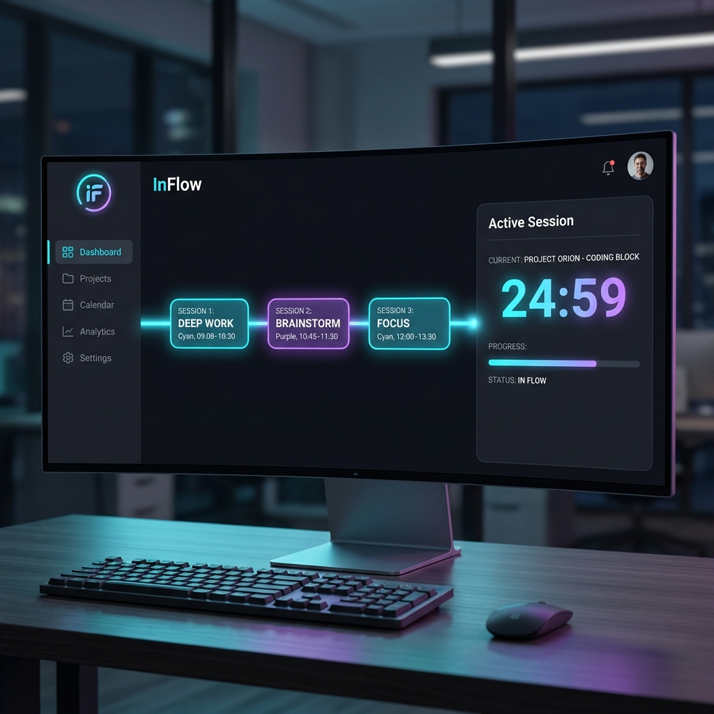

# InFlow



**InFlow** is a modern productivity environment designed to help you achieve deep work through structured sessions. Built with a focus on aesthetics and "flow state", it helps you organize your day into meaningful blocks of time.

## 🌊 How It Works
If you've used **The Sessions**, you'll feel right at home. InFlow adopts a similar philosophy but amplifies it with a dedicated desktop experience. 

Instead of a rigid calendar, InFlow uses **Sessions**:
1.  **Define your flow**: Create blocks (Sessions) for different activities.
2.  **Enter the zone**: Start a session to enter a focused, distraction-free timer view.
3.  **Find your rhythm**: Seamlessly transition from one block to the next.

## ✨ Features
-   **Session Management**: Easily create, edit, and reorder your daily blocks.
-   **Focus Mode**: A distraction-free interface that takes over your screen to keep you on task.
-   **Customizable Appearance**: 
    -   Personalize your experience with themes.
    -   Change icons and block colors to match your mood.
-   **Metrics & Stats**: Track your time spent in flow (Coming Soon).
-   **Minimalist Design**: Crafted with a "senior engineer" standard of UI/UX, featuring glassmorphism and neon accents.

## 🚀 Getting Started

### Installation
Clone the repository:
```bash
git clone https://github.com/getsauce-in/InFlow.git
cd InFlow
```

### Running the App
Ensure you have Python installed.
```bash
pip install -r requirements.txt
python main.py
```

## 🤝 Contributing
We welcome contributions! Please feel free to submit a Pull Request.

---
*Built with ❤️ by the InFlow Team.*
